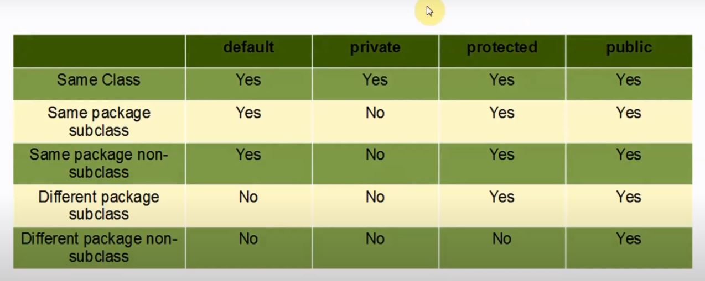
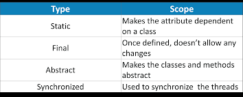

> ## 1. Hello World
```java
public class TestAll {

    public static void main(String[] args) {
        
        System.out.println("Hello world");
    }
}
```
> ## 2. Data types
```java
import java.awt.*;//for using Point 

public class DataTypes {
    public static void main(String[] args) {
       // Primitive Data types
        byte keep = 1; // byte type takes only 1 byte memory
        short number = 45; // short type takes 2 byte memory
        int age = 23; // int type takes 4 byte memory
        long distance = 1_23_4567L;// _ is used instead of , L for denoting long
        float time = 12.23F;// F for denoting float numbers
        
        // Reference Data type
        Point A = new Point(1, 2);
        Point B = A;
        System.out.println("Before changing : " + A);
        
        B.x = 3;
        B.y = 4;
        System.out.println("After Changing : " + A);
        
  }
}// Output: 
// Before changing : java.awt.Point[x=1,y=2]
//After Changing : java.awt.Point[x=3,y=4]
```

> ## 3. Type Casting
```java
        // Implicit Type Casting byte(1)->short(2)->int(4)->long(8) etc
        byte   a = 3;
        short  b = a;//a converted into short
        int    c = b;// b converted into int 
        long d = c;//c converted into long
        
        // explicit type casting 
        System.out.println("Type Cast Double to int: " + (int) 3.95);
```

> ## 4. Taking input 
```java
import java.util.Scanner;
public class TestAll {

    public static void main(String[] args) {
        
        Scanner input = new Scanner(System.in);
        int a = input.nextInt();
        System.out.print("You Entered "+a);//print() doesn't print newline after output but println() does
        input.close();
    }
}
```
> ## 5. Conditional Statements
```java
        // Ternary Operator
        int num = 5;
        System.out.println(num > 0 ? "positive" : "negative");

        // if else statement
        if (num > 0) {
            System.out.println("Positive Number");
        } else {
            System.out.println("Negative Number");
        }

        // if-elseif-else ladder
        if (num == 0) {
            System.out.println("Number is 0");
        } else if (num > 0) {
            System.out.println("Number is positive");
        } else {
            System.out.println("Number is negative");
        }

        // switch statement
        int tracker = num == 0 ? 0 : num > 0 ? 1 : -1;
        switch (tracker) {
            case 0:
                System.out.println("Number is zero");
                break;
            case 1:
                System.out.println("Number is positive");
                break;
            default:
                System.out.println("Number is negative");
        }
```
> ## 6. Looping
```java
        // for loop
        for (int i = 0; i < 5; i++)
            System.out.println("i: " + i);

        // while loop
        int j = 0;
        while (j < 5) {
            System.out.println("j: " + j);
            j++;
        }

        // do-while loop
        int k = 0;
        do {
            System.out.println("k : " + k);
            k++;
        } while (k < 5);

        // For-each loop
        int[] numbers = { 1, 2, 3, 4, 5 };
        for (int keep : numbers) 
            System.out.println("keep : " + keep);        
```
> ## 7. Math Library
```java
        System.out.println("Random number between 0 and 1: " + Math.random());
        System.out.println("Random number between 0 and 100: " + (int) (Math.random() * 100));
        System.out.println("Max between 2 & 5: " + Math.max(2, 5));
        System.out.println("Min between 2 & 5: " + Math.min(2, 5));
        System.out.println("Absolute value of -5: " + Math.abs(-5));
        System.out.println("Ceil value of 2.5: " + Math.ceil(2.5));
        System.out.println("Floor value of 2.5: " + Math.floor(2.5));
        System.out.println("round value of 2.5: " + Math.round(2.5));
        System.out.println("Converting String to integer: " + Integer.parseInt("123"));
        System.out.println("Converting integer to float: " + Float.parseFloat("2"));
        System.out.println("Converting string to double: " + Double.parseDouble("2"));
```
> ## 8. String Methods
```java
        String name = "Ruman Bhuiyan";
        System.out.println("Is String empty : " + name.isEmpty());
        System.out.println("String Length: " + name.length());
        System.out.println("Index of a character: " + name.indexOf('R'));
        System.out.println("Lower Case: " + name.toLowerCase());
        System.out.println("Upper Case : " + name.toUpperCase());
        System.out.println("Removing extra spaces : " + name.trim());
        System.out.println("Replacing a character: " + name.replace('R', 'B'));
```
> ## 9. Threads 
> ### Threads can be created in two way  i)extending Threads class  ii) implementing Runnable interface
```java
    // Process 01
    public class TestAll extends Thread{

    public String name;
    public int time;

    public static void main(String[] args) {

        TestAll t1 = new TestAll("Ruman", 2000);
        t1.start();
    }

    // Initializing variables by calling its constructor
    TestAll(String name,int time){
        this.name=name;
        this.time=time;
    }

    // Thread.start() will call this method
    public void run() {
         try{
            System.out.println("Hello");
            Thread.sleep(time);
            System.out.println(name);
        } catch (Exception e) {
             System.out.println(e);
         }
        
    }
}

```
```java
    // Process 02
    public class TestAll implements Runnable{

    public String name;
    public int time;

    public static void main(String[] args) {
        
        TestAll test = new TestAll("Ruman", 2000);
        Thread t1 = new Thread(test);
        t1.start();
    }

    // Initializing variables by calling its constructor
    TestAll(String name,int time){
        this.name=name;
        this.time=time;
    }

    // Thread.start() will call this method
    public void run() {
         try{
            System.out.println("Hello");
            Thread.sleep(time);
            System.out.println(name);
        } catch (Exception e) {
             System.out.println(e);
         }
        
    }
}

```
> ### If thread is created by using `extends Threads` then main class gets all property of Threads so we don't need to create an instance of Thread class and pass object of main class to it .Just we have to override `run()` method to say explicitely what to do when `thread.start()` gets called. On the other hand if thread is made by using `implements Runnable` then its required to create an instance of Thread class and pass object of main class to it and `run()` method will remain same alike before. Look if we create thread by `extends Thread` then we can't extend other classes but implement other interfaces.Again if we create thread by `implements Runnable` then we can extend other class too.Thread class  provides some inbuilt methods like `yield()`, `interrupt()` etc. that are not available in Runnable interface.Using runnable will give you an object that can be shared amongst multiple threads. 
> ### Concurrency Problems : As threads run at the same time as other parts of the program, there is no way to know in which order the code will run. When the threads and main program are reading and writing the same variables, the values are unpredictable. The problems that result from this are called concurrency problems.
```java

    public class TestAll extends Thread {
    
    public static int count = 0;
    public static void main(String[] args) {
        
        TestAll t1 = new TestAll();
        t1.start();
        System.out.println("count : " + count);
        count++;
        System.out.println("count : " + count);
        }

    // Thread.start() will call this method
    public void run() {
        count++;
    }
}
// outut: 
// count : 0
// count : 2
```
> ### Solving Concurrency Problem
```java

    public class TestAll extends Thread {
    
    public static int count = 0;
    public static void main(String[] args) {
        
        TestAll t1 = new TestAll();
        t1.start();
        while (t1.isAlive()); //dont execute next line untill t1 finished
        System.out.println("count : " + count);
        count++;
        System.out.println("count : " + count);
        }

    // Thread.start() will call this method
    public void run() {
        count++;
    }
}
// outut: 
// count : 1
// count : 2
```
> ## 10. Garbage Collector
> In C/C++, programmer is responsible for both creation and destruction of objects. Usually programmer neglects destruction of useless objects.Due to this negligence, at certain point, for creation of new objects, sufficient memory may not be available and entire program will terminateabnormally causing OutOfMemoryErrors.But in Java, the programmer need not to care for all those objects which are no longer in use. Garbage collector destroys these objects.Garbage collector is best example of Daemon thread as it is always running in background.Main objective of Garbage Collector is to free heap memory by destroying
```java
//Garbage Collector 
// 1.https://www.geeksforgeeks.org/garbage-collection-java/
// 2.https://www.guru99.com/java-garbage-collection.html
public class GarbageCollector {
    public static String name;
    public static double age;

    public static void main(String[] args) throws InterruptedException {
        // creates two block of two variable called name,age in heap memory
        // they contain the reference of that address of heap memory
        GarbageCollector first = new GarbageCollector();
        GarbageCollector second = new GarbageCollector();
        // null can be assigned only in Reference type object not primitive type
        // now first doesn't have any reference so block of heap memory will be
        // garbage collector
        first = null;
        // though JVM performs garbage collection automatically to do this manually
        // requesting JVM for running Garbage Collector
        System.gc();

        second = null;
        // requesting JVM for running Garbage Collector
        Runtime.getRuntime().gc();
    }

    @Override
    // finalize method is called on object once
    // before garbage collecting it
    protected void finalize() throws Throwable {
        System.out.println("Garbage collector called");
        System.out.println("Object garbage collected : " + this);
    }
}

```
> ## 11. Java Modifiers <br>         
> ## i) Access Modifier(private,default,protected,public) <br>     
>   <br>
> ## ii) Non-Access Modifier (static,final,abstract,transient,synchronized,volatile) <br>
- ### `static methods or variables` can be accessed by their class name <br>
- ###  `final class` can't be `inherited (extended)` and `final variables` can't be changed after initialization and `final method` can't be overriden
- ###   `abstract class` can't be used to create object but if any class `extends` it then it has to implement all the `abstract method` inside the abstract class 
- ###   When an instance variable is declared as `transient`, then its value doesn't persist when an object is serialized
- ###   When a method is `synchronized` it can be accessed by `only one thread at a time`
- ###  `volatile` modifier tells to the compiler that the volatile variable can be changed unexpectedly by other parts of a program. Volatile variables are used in case of `multi-threading` program. volatile keyword `cannot be used with a method or a class`. It can be `only used with a variable`.
>  

> ## 12. OOP (Abstraction, Polymorphism,Inheritance,Encapsulation) <br>
> ##  Object and Class
```java

    public class TestAll {

    String name;// name has default access modifier
    double age;// age has default access modifier

    public static void main(String[] args) {

        TestAll person1 = new TestAll("Ruman", 23);
        person1.showInfo();
    }

    // Constructor get called at the time of object creation
    TestAll(String name, double age) {
        System.out.println("Constructor called.....");
        this.name = name;
        this.age = age;
    }

    void showInfo() {
        System.out.println("You are " + name + ".you are " + (int) age + " years old");
    }
}

```
> ## Inheritance 
```java

    public class Area {
    
    final double length;
    final double width;

    //Constructor 
    Area(double len, double wid) {
        length = len;
        width = wid;
    }
  
    public double getArea() {
        return length * width;
    } 
}

```
```java

    public class TestAll  extends Area{

    public static void main(String[] args) {

        TestAll child = new TestAll(2, 3);
        System.out.println("Area is "+child.getArea());
        System.out.println("volume is " + child.getVolume(child.getArea(), 5));
    }
    //constructor
    TestAll(double len, double wid) {
        super(len, wid);// calling superclass(Area) constructor
    }
    // Adding new property to child class along with parent class properties
    double getVolume(double area, double hight) {
        return area * hight;
    }
}

```
> ## Abstraction
```java
     abstract class Geometry {
  
     abstract double getArea();
 
     abstract double getVolume();
}
```
```java

    public class TestAll  extends Geometry{

    public static void main(String[] args) {
      
        TestAll child = new TestAll();

        System.out.println(child.getArea(3,4));
        System.out.println(child.getVolume(child.getArea(3,4), 5));
    }

    public double getArea(double len,double wid) {
        return len * wid;
    }
    
    public double getVolume(double area,double height) {
        return area*height;
    }
}

```
> ## Interface (As Java doesn't allow multi-inheritance so that case can be achieved by implementing multi-interface)
```java
    interface Bio {
    
    abstract void getName();

    abstract void getAge();
}
```
```java
     interface Geometry {
  
     abstract double getArea();
 
     abstract double getVolume();
}
```
```java

    public class TestAll implements Bio,Geometry {

    public static void main(String[] args) {
        
        TestAll child = new TestAll();

        child.getName();
        child.getAge();
    }

    public void getName() {
        System.out.println("You are Ruman");

    }

    public void getAge() {
        System.out.println("You are 23 years old");
    }

    public double getArea(double len, double wid) {
        return len * wid;
    }

    public double getVolume(double area, double height) {
        return area * height;
    }
}

```
